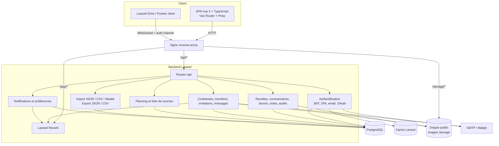

# Composants

```mermaid
flowchart TB
    subgraph Client[Client]
        SPA[SPA Vue 3 + TypeScript\nVue Router + Pinia]
        Echo[Laravel Echo / Pusher client]
    end
    Nginx[Nginx reverse-proxy]
    subgraph Backend[Backend Laravel]
        Api[Routes /api]
        Auth[Authentification\nJWT, 2FA, email, OAuth]
        Recipes[Recettes, commentaires, favoris, notes, audits]
        Cookbooks[Cookbooks, membres, invitations, messages]
        Planning[Planning et liste de courses]
        IO[Import JSON / CSV / Mealie\nExport JSON / CSV]
        Notifications[Notifications et préférences]
        Reverb[Laravel Reverb]
    end
    DB[(PostgreSQL)]
    Cache[(Cache Laravel)]
    Files[(Disque public\nimages /storage)]
    Mailpit[SMTP / Mailpit]
    SPA -->|HTTP| Nginx
    Echo -->|WebSocket + auth channel| Nginx
    Nginx -->|/api/*| Api
    Nginx -->|/storage/*| Files
    Nginx -->|/app/*| Reverb
    Api --> Auth & Recipes & Cookbooks & Planning & IO & Notifications
    Auth --> DB & Cache & Mailpit
    Recipes --> DB & Files
    Cookbooks --> DB & Files & Mailpit & Reverb
    Planning --> DB
    IO --> DB
    Notifications --> DB & Reverb
```
