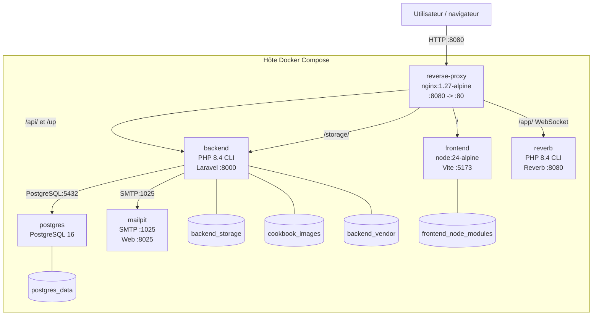

# Déploiement

```mermaid
flowchart TB
    subgraph Host[Hôte Docker Compose]
        proxy[reverse-proxy\nnginx:1.27-alpine\n:8080 -> :80]
        frontend[frontend\nnode:24-alpine\nVite :5173]
        backend[backend\nPHP 8.4 CLI\nLaravel :8000]
        reverb[reverb\nPHP 8.4 CLI\nReverb :8080]
        postgres[postgres\nPostgreSQL 16]
        mailpit[mailpit\nSMTP :1025\nWeb :8025]
        storage[(backend_storage)]
        cookbookImages[(cookbook_images)]
        vendor[(backend_vendor)]
        nodeModules[(frontend_node_modules)]
        pgdata[(postgres_data)]
    end
    Internet[Utilisateur / navigateur] -->|HTTP :8080| proxy
    proxy -->|/| frontend
    proxy -->|/api/ et /up| backend
    proxy -->|/app/ WebSocket| reverb
    proxy -->|/storage/| backend
    backend -->|PostgreSQL:5432| postgres
    backend -->|SMTP:1025| mailpit
    backend --- storage & cookbookImages & vendor
    frontend --- nodeModules
    postgres --- pgdata
```
