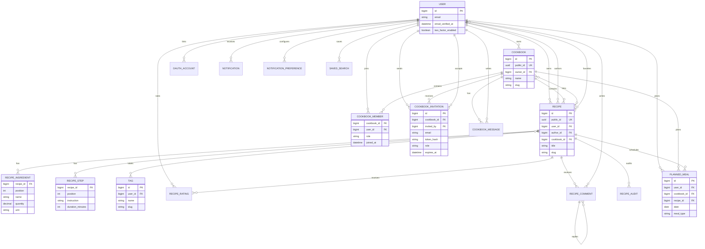

# Entités

```mermaid
erDiagram
    USER ||--o{ RECIPE : owns
    USER ||--o{ RECIPE : authors
    USER ||--o{ COOKBOOK : owns
    USER ||--o{ COOKBOOK_MEMBER : joins
    COOKBOOK ||--o{ COOKBOOK_MEMBER : contains
    COOKBOOK ||--o{ RECIPE : contains
    COOKBOOK }o--o{ RECIPE : links
    USER ||--o{ COOKBOOK_INVITATION : sends
    COOKBOOK ||--o{ COOKBOOK_INVITATION : receives
    USER ||--o{ COOKBOOK_INVITATION : accepts
    RECIPE ||--o{ RECIPE_INGREDIENT : has
    RECIPE ||--o{ RECIPE_STEP : has
    RECIPE }o--o{ TAG : labels
    USER }o--o{ RECIPE : favorites
    USER ||--o{ RECIPE_RATING : rates
    RECIPE ||--o{ RECIPE_RATING : receives
    RECIPE ||--o{ RECIPE_COMMENT : receives
    USER ||--o{ RECIPE_COMMENT : writes
    RECIPE_COMMENT ||--o{ RECIPE_COMMENT : replies
    RECIPE ||--o{ RECIPE_AUDIT : audits
    USER ||--o{ PLANNED_MEAL : plans
    COOKBOOK ||--o{ PLANNED_MEAL : plans
    RECIPE ||--o{ PLANNED_MEAL : schedules
    COOKBOOK ||--o{ COOKBOOK_MESSAGE : has
    USER ||--o{ COOKBOOK_MESSAGE : writes
    USER ||--o{ OAUTH_ACCOUNT : links
    USER ||--o{ NOTIFICATION : receives
    USER ||--o{ NOTIFICATION_PREFERENCE : configures
    USER ||--o{ SAVED_SEARCH : saves

    USER { bigint id PK string email datetime email_verified_at boolean two_factor_enabled }
    RECIPE { bigint id PK uuid public_id UK bigint user_id FK bigint author_id FK bigint cookbook_id FK string title string slug }
    COOKBOOK { bigint id PK uuid public_id UK bigint owner_id FK string name string slug }
    COOKBOOK_MEMBER { bigint cookbook_id FK bigint user_id FK string role datetime joined_at }
    COOKBOOK_INVITATION { bigint id PK bigint cookbook_id FK bigint invited_by FK string email string token_hash string role datetime expires_at }
    RECIPE_INGREDIENT { bigint recipe_id FK int position string name decimal quantity string unit }
    RECIPE_STEP { bigint recipe_id FK int position string instruction int duration_minutes }
    TAG { bigint id PK bigint user_id FK string name string slug }
    PLANNED_MEAL { bigint id PK bigint user_id FK bigint cookbook_id FK bigint recipe_id FK date date string meal_type }
```
