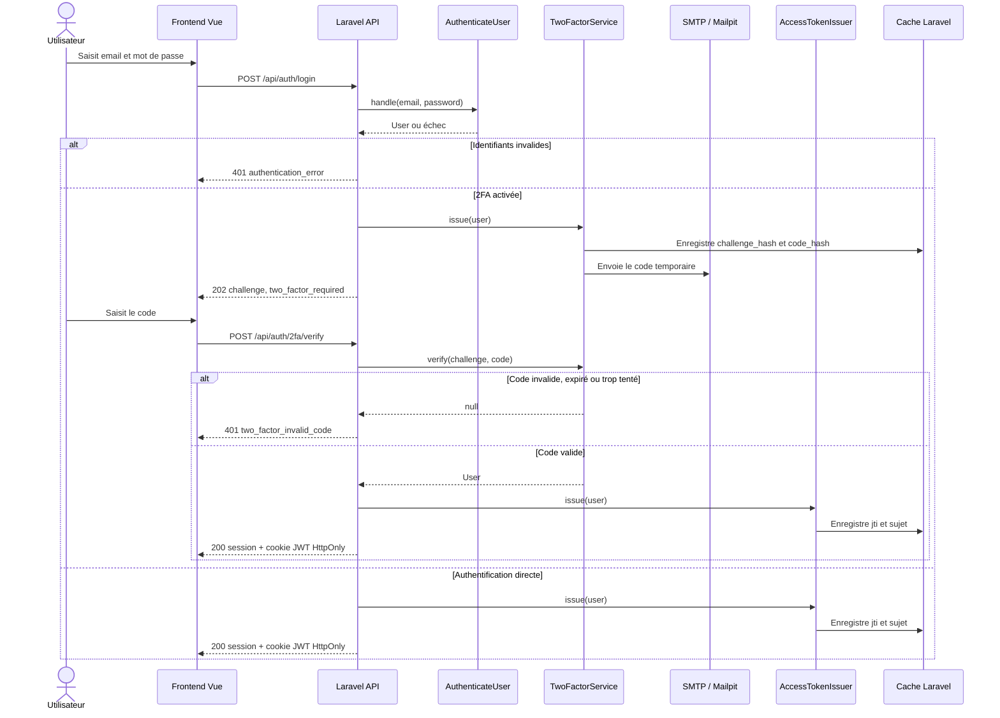

# Séquence de connexion

```mermaid
sequenceDiagram
    actor U as Utilisateur
    participant SPA as Frontend Vue
    participant API as Laravel API
    participant Auth as AuthenticateUser
    participant TFA as TwoFactorService
    participant Mail as SMTP / Mailpit
    participant JWT as AccessTokenIssuer
    participant Cache as Cache Laravel
    U->>SPA: Saisit email et mot de passe
    SPA->>API: POST /api/auth/login
    API->>Auth: handle(email, password)
    Auth-->>API: User ou échec
    alt Identifiants invalides
        API-->>SPA: 401 authentication_error
    else 2FA activée
        API->>TFA: issue(user)
        TFA->>Cache: Enregistre challenge_hash et code_hash
        TFA->>Mail: Envoie le code temporaire
        API-->>SPA: 202 challenge, two_factor_required
        U->>SPA: Saisit le code
        SPA->>API: POST /api/auth/2fa/verify
        API->>TFA: verify(challenge, code)
        alt Code invalide, expiré ou trop tenté
            TFA-->>API: null
            API-->>SPA: 401 two_factor_invalid_code
        else Code valide
            TFA-->>API: User
            API->>JWT: issue(user)
            JWT->>Cache: Enregistre jti et sujet
            API-->>SPA: 200 session + cookie JWT HttpOnly
        end
    else Authentification directe
        API->>JWT: issue(user)
        JWT->>Cache: Enregistre jti et sujet
        API-->>SPA: 200 session + cookie JWT HttpOnly
    end
```
