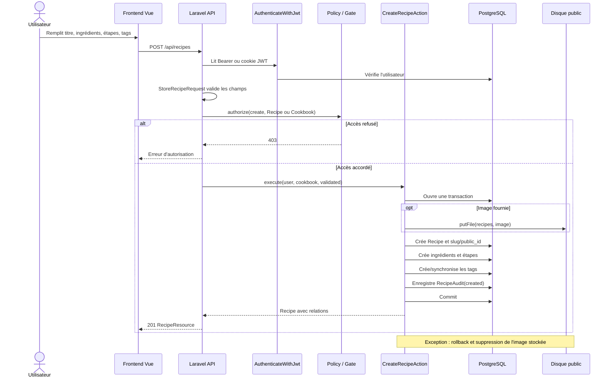

# Séquence de création d’une recette

```mermaid
sequenceDiagram
    actor U as Utilisateur
    participant SPA as Frontend Vue
    participant API as Laravel API
    participant JWT as AuthenticateWithJwt
    participant Gate as Policy / Gate
    participant Action as CreateRecipeAction
    participant DB as PostgreSQL
    participant Files as Disque public
    U->>SPA: Remplit titre, ingrédients, étapes, tags
    SPA->>API: POST /api/recipes
    API->>JWT: Lit Bearer ou cookie JWT
    JWT->>DB: Vérifie l'utilisateur
    API->>API: StoreRecipeRequest valide les champs
    API->>Gate: authorize(create, Recipe ou Cookbook)
    alt Accès refusé
        Gate-->>API: 403
        API-->>SPA: Erreur d'autorisation
    else Accès accordé
        API->>Action: execute(user, cookbook, validated)
        Action->>DB: Ouvre une transaction
        opt Image fournie
            Action->>Files: putFile(recipes, image)
        end
        Action->>DB: Crée Recipe et slug/public_id
        Action->>DB: Crée ingrédients et étapes
        Action->>DB: Crée/synchronise les tags
        Action->>DB: Enregistre RecipeAudit(created)
        Action->>DB: Commit
        Action-->>API: Recipe avec relations
        API-->>SPA: 201 RecipeResource
    end
    Note over Action,Files: Exception : rollback et suppression de l'image stockée
```
