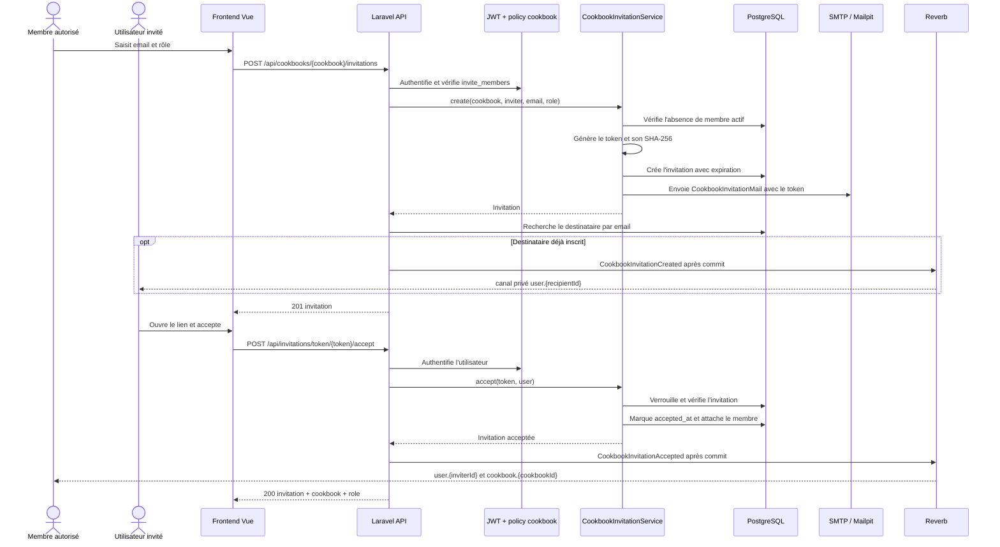

# Séquence d’invitation à un cookbook

```mermaid
sequenceDiagram
    actor Owner as Membre autorisé
    actor Invitee as Utilisateur invité
    participant SPA as Frontend Vue
    participant API as Laravel API
    participant JWT as JWT + policy cookbook
    participant Service as CookbookInvitationService
    participant DB as PostgreSQL
    participant Mail as SMTP / Mailpit
    participant Reverb as Reverb
    Owner->>SPA: Saisit email et rôle
    SPA->>API: POST /api/cookbooks/{cookbook}/invitations
    API->>JWT: Authentifie et vérifie invite_members
    API->>Service: create(cookbook, inviter, email, role)
    Service->>DB: Vérifie l'absence de membre actif
    Service->>Service: Génère le token et son SHA-256
    Service->>DB: Crée l'invitation avec expiration
    Service->>Mail: Envoie CookbookInvitationMail avec le token
    Service-->>API: Invitation
    API->>DB: Recherche le destinataire par email
    opt Destinataire déjà inscrit
        API->>Reverb: CookbookInvitationCreated après commit
        Reverb-->>Invitee: canal privé user.{recipientId}
    end
    API-->>SPA: 201 invitation
    Invitee->>SPA: Ouvre le lien et accepte
    SPA->>API: POST /api/invitations/token/{token}/accept
    API->>JWT: Authentifie l'utilisateur
    API->>Service: accept(token, user)
    Service->>DB: Verrouille et vérifie l'invitation
    Service->>DB: Marque accepted_at et attache le membre
    Service-->>API: Invitation acceptée
    API->>Reverb: CookbookInvitationAccepted après commit
    Reverb-->>Owner: user.{inviterId} et cookbook.{cookbookId}
    API-->>SPA: 200 invitation + cookbook + role
```
