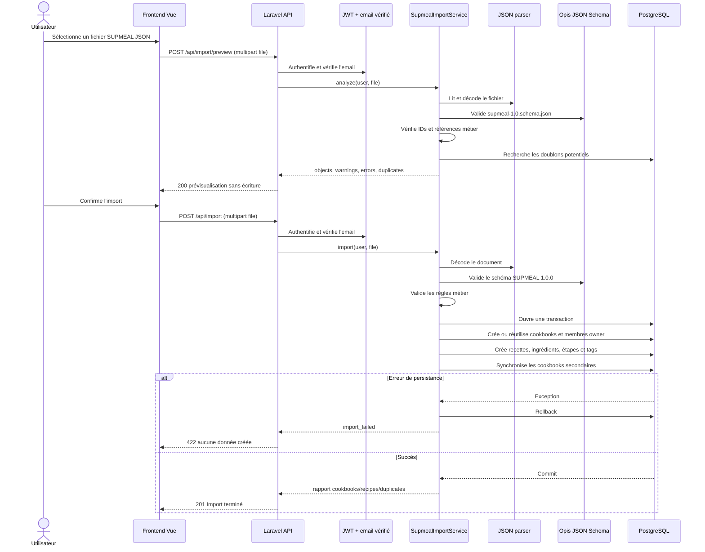

# Séquence d’import JSON

```mermaid
sequenceDiagram
    actor U as Utilisateur
    participant SPA as Frontend Vue
    participant API as Laravel API
    participant JWT as JWT + email vérifié
    participant Import as SupmealImportService
    participant JSON as JSON parser
    participant Schema as Opis JSON Schema
    participant DB as PostgreSQL
    U->>SPA: Sélectionne un fichier SUPMEAL JSON
    SPA->>API: POST /api/import/preview (multipart file)
    API->>JWT: Authentifie et vérifie l'email
    API->>Import: analyze(user, file)
    Import->>JSON: Lit et décode le fichier
    Import->>Schema: Valide supmeal-1.0.schema.json
    Import->>Import: Vérifie IDs et références métier
    Import->>DB: Recherche les doublons potentiels
    Import-->>API: objects, warnings, errors, duplicates
    API-->>SPA: 200 prévisualisation sans écriture
    U->>SPA: Confirme l'import
    SPA->>API: POST /api/import (multipart file)
    API->>JWT: Authentifie et vérifie l'email
    API->>Import: import(user, file)
    Import->>JSON: Décode le document
    Import->>Schema: Valide le schéma SUPMEAL 1.0.0
    Import->>Import: Valide les règles métier
    Import->>DB: Ouvre une transaction
    Import->>DB: Crée ou réutilise cookbooks et membres owner
    Import->>DB: Crée recettes, ingrédients, étapes et tags
    Import->>DB: Synchronise les cookbooks secondaires
    alt Erreur de persistance
        DB-->>Import: Exception
        Import->>DB: Rollback
        Import-->>API: import_failed
        API-->>SPA: 422 aucune donnée créée
    else Succès
        DB-->>Import: Commit
        Import-->>API: rapport cookbooks/recipes/duplicates
        API-->>SPA: 201 Import terminé
    end
```
